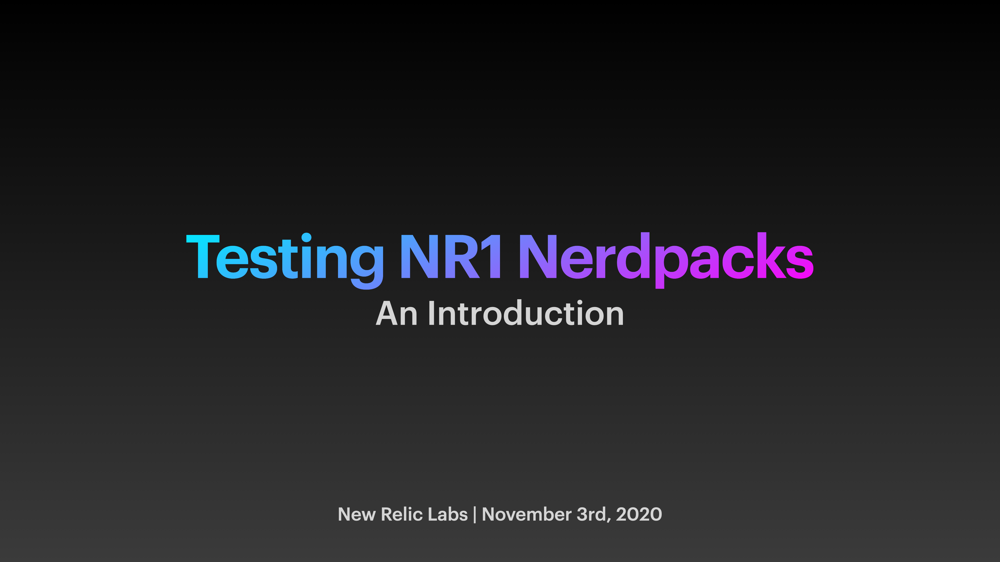

# Testing NR1 Nerdpacks

This is the companion repo for the brown bag session on **Testing NR1 Nerdpacks**.

This repo contains the [presentation](slides.pdf), sample code and a [mock for the NR1 object](__mocks__).

The code in the repo is [tagged](tags). To follow along with the presentation, checkout the tag for the appropriate sections in the presentation.

## License
nr1-testing-intro is licensed under the [Apache 2.0](http://apache.org/licenses/LICENSE-2.0.txt) License.

nr1-testing-intro also uses source code from third-party libraries. You can find full details on which libraries are used and the terms under which they are licensed in the [third-party notices](THIRD_PARTY_NOTICES.md) document.
